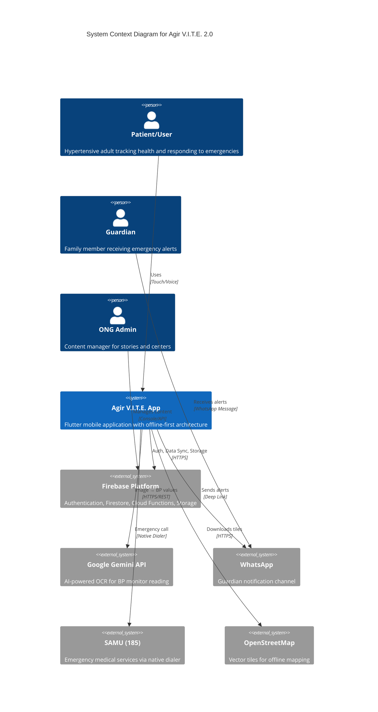
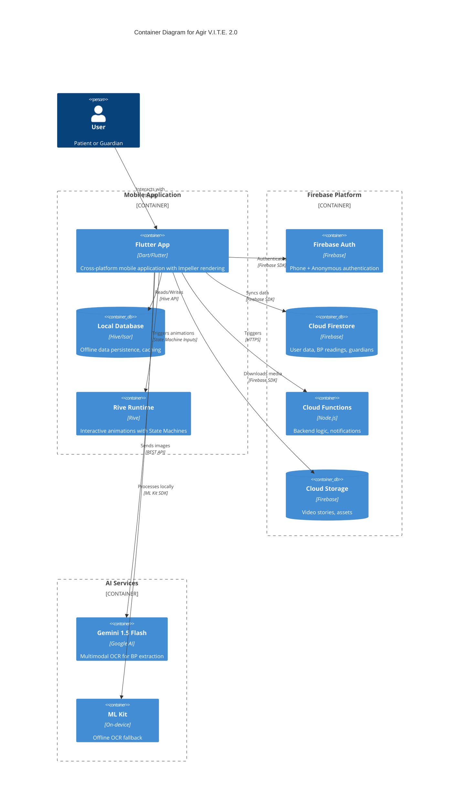
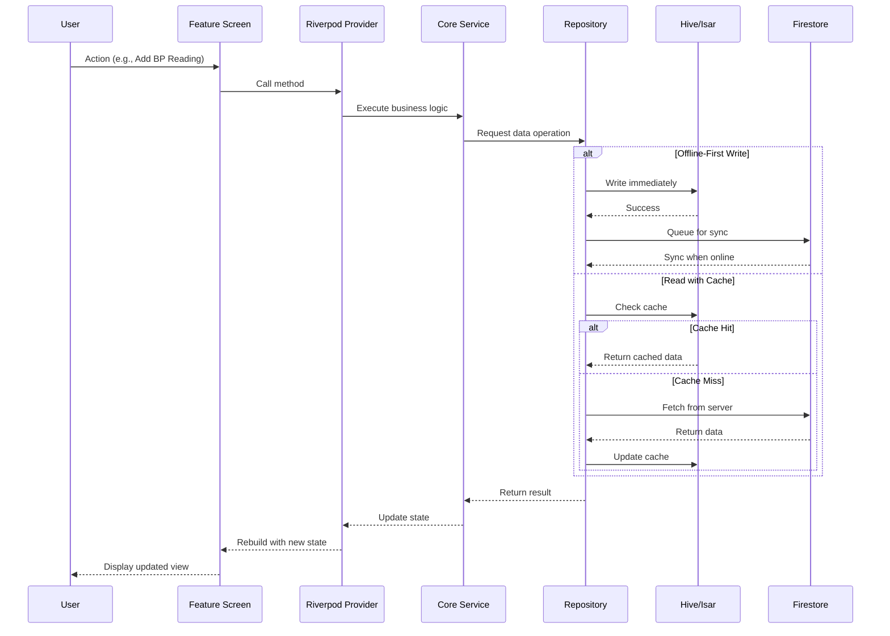
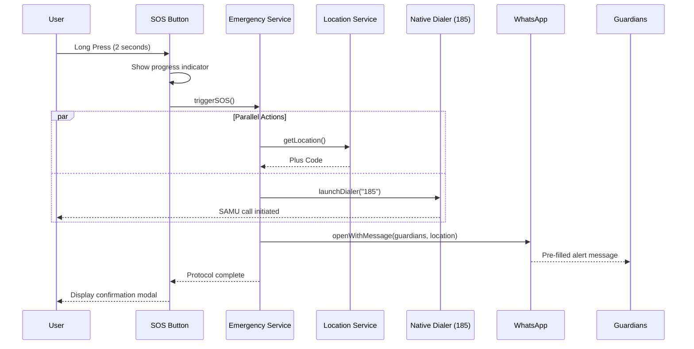
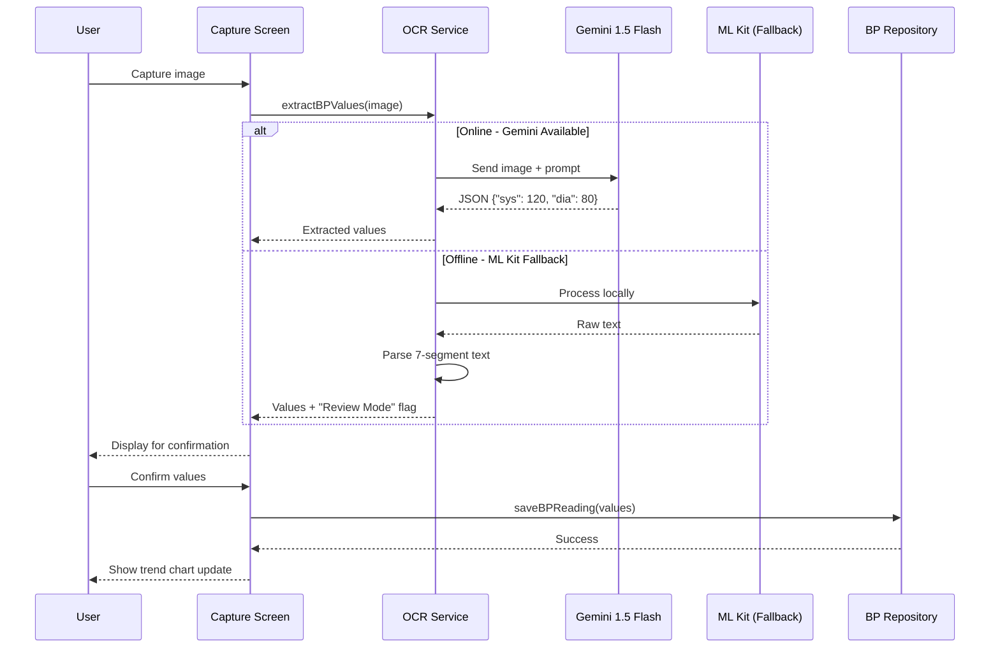
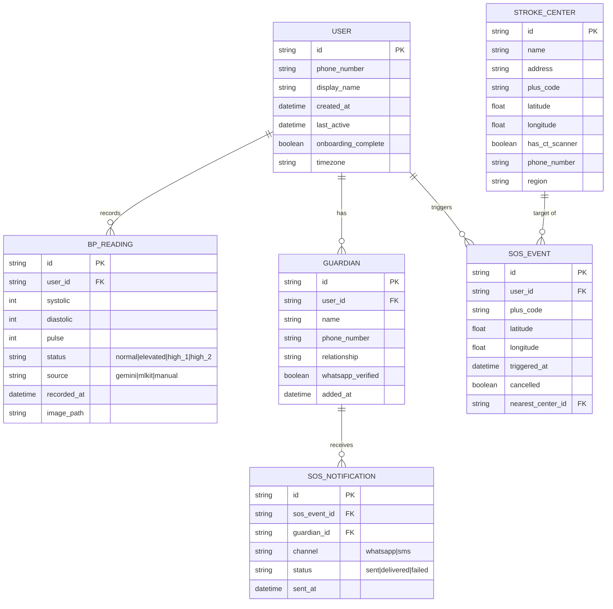
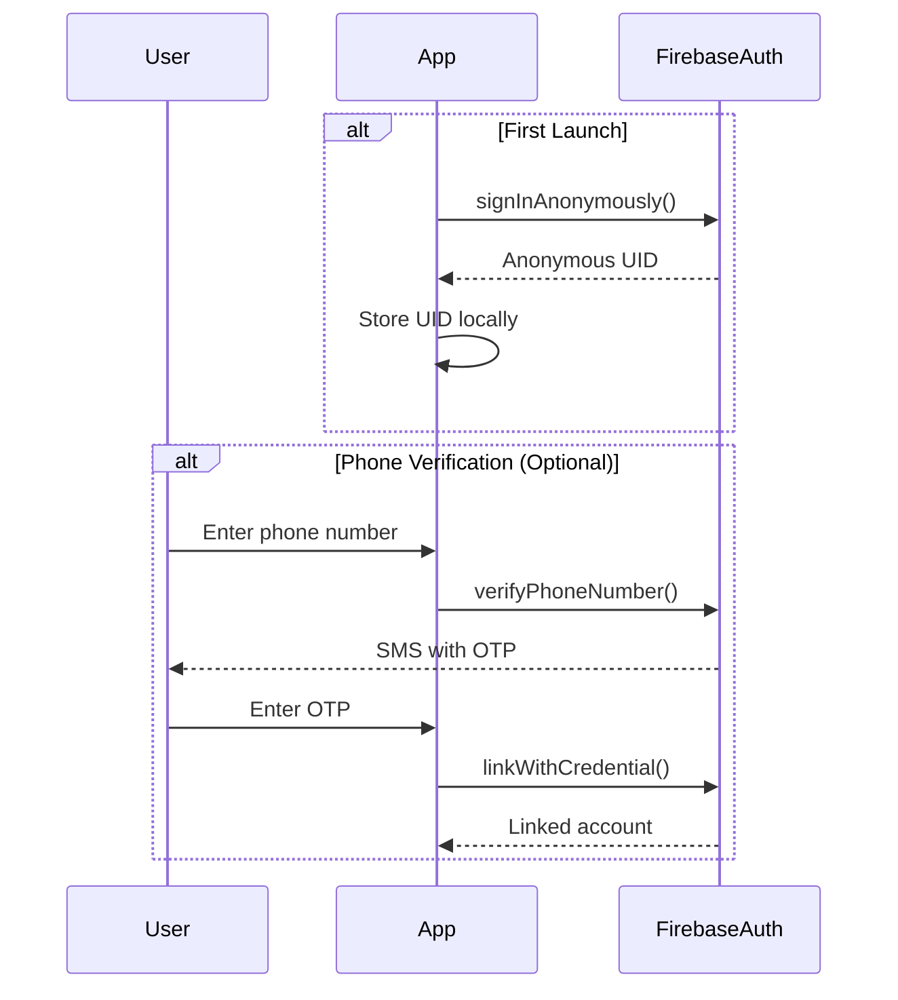
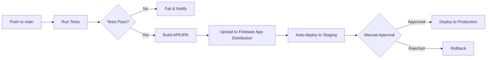

# **1. Architecture Overview (The Map)**

*High-level system design identifying boundaries and external systems for Agir V.I.T.E. 2.0 — a stroke prevention mobile application.*

## **1.1 C4 Context Diagram**



## **1.2 C4 Container Diagram**



## **1.3 Offline-First Architecture Principles**

| Principle                    | Implementation                                                            |
| :--------------------------- | :------------------------------------------------------------------------ |
| **Local-First Data**         | All user data written to Hive/Isar first, synced to Firestore when online |
| **Pessimistic Connectivity** | Assume offline; treat online as enhancement                               |
| **Graceful Degradation**     | AI-OCR falls back to ML Kit; WhatsApp falls back to native SMS (Phase 3)  |
| **Content Pre-bundling**     | V.I.T.E. animations, audio, and map tiles bundled with APK                |
| **Queue-Based Sync**         | Offline writes queued and flushed on connectivity restoration             |

---

# **2. Technical Stack & Development Environment**

*Specific version constraints to prevent AI "knowledge drift" and ensure consistency.*

## **2.1 Dependencies**

| Category              | Technology                | Version             | Constraints/Notes                     |
| :-------------------- | :------------------------ | :------------------ | :------------------------------------ |
| **Language**          | Dart                      | 3.x                 | Null safety required                  |
| **Framework**         | Flutter                   | 3.24+               | Impeller engine mandatory for Android |
| **Rendering**         | Impeller                  | Default             | Required for 60fps Rive animations    |
| **Backend**           | Firebase                  | Latest              | Firestore, Auth, Functions, Storage   |
| **Local Database**    | Hive or Isar              | Hive 2.x / Isar 3.x | NoSQL, fast, offline-optimized        |
| **State Management**  | Riverpod                  | 2.x                 | Compile-time safe, testable           |
| **Animations**        | Rive                      | 0.13+               | State Machine-driven animations       |
| **Charts**            | fl_chart                  | 0.68+               | Animated health data visualization    |
| **Mapping**           | flutter_map               | 6.x                 | With vector_map_tiles for offline     |
| **AI-OCR (Primary)**  | Gemini 1.5 Flash          | 1.5                 | Multimodal, JSON output               |
| **AI-OCR (Fallback)** | ML Kit (Text Recognition) | Latest              | On-device offline OCR                 |
| **Location**          | geolocator                | 12.x                | GPS with Plus Code conversion         |
| **Launcher**          | url_launcher              | 6.x                 | Native dialer, WhatsApp deep links    |
| **HTTP Client**       | dio                       | 5.x                 | For Gemini API calls                  |

## **2.2 Development Prerequisites**

* **Runtime:**
  * Flutter SDK 3.24+
  * Dart SDK 3.x
  * Android SDK 34+ (for Impeller)
  * Xcode 15+ (for iOS)

* **Build Tools:**
  * Android Studio / VS Code with Flutter plugins
  * CocoaPods (iOS)
  * Gradle 8.x (Android)

* **Package Manager:** `flutter pub` (pubspec.yaml)

* **Firebase CLI:** Required for deployment
  * `firebase-tools` npm package

* **Environment Variables (`.env` file, not committed):**
  ```
  GEMINI_API_KEY=<Google AI Studio API Key>
  FIREBASE_PROJECT_ID=<Firebase Project ID>
  SAMU_NUMBER=185
  WHATSAPP_FALLBACK=true
  ```

* **Required Firebase Services:**
  * Authentication (Phone + Anonymous)
  * Cloud Firestore (with offline persistence enabled)
  * Cloud Functions (Node.js 18+)
  * Cloud Storage (for video stories)

## **2.3 Build Configurations**

| Environment | Description                       | Firebase Project |
| :---------- | :-------------------------------- | :--------------- |
| `dev`       | Development with mock data        | agirvite-dev     |
| `staging`   | Testing with production-like data | agirvite-staging |
| `prod`      | Production release                | agirvite-prod    |

---

# **3. Repository Structure**

*The Agent must follow this file organization strictly per Global Rules (Rule 14).*

```
/
├── docs/                          # Documentation (PRD, ARCHI, Design System)
│   ├── PRD.md                     # Product Requirements Document
│   ├── ARCHI.md                   # This document
│   ├── DESIGN_SYSTEM.md           # UI/UX specifications
│   └── Global_Rules.md            # Development rules
│
├── android/                       # Android native configuration
│   └── app/
│       └── build.gradle           # Impeller enabled, signing configs
│
├── ios/                           # iOS native configuration
│   └── Runner/
│       └── Info.plist             # Permissions, URL schemes
│
├── lib/                           # Main Flutter application source
│   ├── main.dart                  # App entry point
│   ├── app/                       # App-level configuration
│   │   ├── app.dart               # MaterialApp setup
│   │   ├── routes.dart            # Navigation/routing definitions
│   │   └── theme/                 # "Serene Wave" theme implementation
│   │       ├── colors.dart        # Color palette constants
│   │       ├── typography.dart    # Text styles
│   │       └── theme.dart         # ThemeData composition
│   │
│   ├── core/                      # Business Logic / Domain Layer
│   │   ├── models/                # Data models/entities
│   │   │   ├── user.dart
│   │   │   ├── bp_reading.dart
│   │   │   ├── guardian.dart
│   │   │   └── stroke_center.dart
│   │   ├── services/              # Core services
│   │   │   ├── auth_service.dart
│   │   │   ├── emergency_service.dart
│   │   │   ├── bp_tracker_service.dart
│   │   │   ├── ocr_service.dart
│   │   │   ├── guardian_service.dart
│   │   │   └── location_service.dart
│   │   ├── repositories/          # Data access abstraction
│   │   │   ├── user_repository.dart
│   │   │   ├── bp_repository.dart
│   │   │   ├── guardian_repository.dart
│   │   │   └── content_repository.dart
│   │   └── utils/                 # Shared utilities
│   │       ├── plus_code.dart     # GPS to Plus Code conversion
│   │       ├── validators.dart    # Input validation
│   │       └── constants.dart     # App-wide constants
│   │
│   ├── data/                      # Data Layer
│   │   ├── local/                 # Local database (Hive/Isar)
│   │   │   ├── local_database.dart
│   │   │   ├── adapters/          # Hive type adapters
│   │   │   └── boxes/             # Hive box definitions
│   │   ├── remote/                # Remote data sources
│   │   │   ├── firebase_client.dart
│   │   │   ├── gemini_client.dart
│   │   │   └── api_endpoints.dart
│   │   └── mappers/               # Data transformation
│   │       └── bp_reading_mapper.dart
│   │
│   ├── features/                  # Feature Modules (Vertical Slices)
│   │   ├── onboarding/            # Onboarding flow
│   │   │   ├── screens/
│   │   │   │   ├── brand_screen.dart
│   │   │   │   ├── pledge_screen.dart
│   │   │   │   └── reflex_drill_screen.dart
│   │   │   ├── widgets/
│   │   │   └── providers/
│   │   │       └── onboarding_provider.dart
│   │   │
│   │   ├── dashboard/             # Home dashboard
│   │   │   ├── screens/
│   │   │   │   └── dashboard_screen.dart
│   │   │   ├── widgets/
│   │   │   │   ├── status_card.dart
│   │   │   │   ├── action_card.dart
│   │   │   │   └── bento_grid.dart
│   │   │   └── providers/
│   │   │       └── dashboard_provider.dart
│   │   │
│   │   ├── vite_guide/            # V.I.T.E. Interactive Guide
│   │   │   ├── screens/
│   │   │   │   ├── vite_guide_screen.dart
│   │   │   │   ├── visage_screen.dart
│   │   │   │   ├── incapacite_screen.dart
│   │   │   │   ├── trouble_screen.dart
│   │   │   │   └── en_urgence_screen.dart
│   │   │   ├── widgets/
│   │   │   │   └── animated_avatar.dart
│   │   │   └── providers/
│   │   │       └── vite_provider.dart
│   │   │
│   │   ├── emergency/             # Emergency SOS
│   │   │   ├── screens/
│   │   │   │   └── emergency_modal.dart
│   │   │   ├── widgets/
│   │   │   │   ├── sos_button.dart
│   │   │   │   └── slide_to_call.dart
│   │   │   └── providers/
│   │   │       └── emergency_provider.dart
│   │   │
│   │   ├── bp_tracker/            # Blood Pressure Tracker
│   │   │   ├── screens/
│   │   │   │   ├── capture_screen.dart
│   │   │   │   ├── history_screen.dart
│   │   │   │   └── manual_entry_screen.dart
│   │   │   ├── widgets/
│   │   │   │   ├── bp_chart.dart
│   │   │   │   └── reading_card.dart
│   │   │   └── providers/
│   │   │       └── bp_tracker_provider.dart
│   │   │
│   │   ├── guardians/             # Cercles de Vie
│   │   │   ├── screens/
│   │   │   │   ├── guardians_screen.dart
│   │   │   │   └── add_guardian_screen.dart
│   │   │   ├── widgets/
│   │   │   │   └── guardian_card.dart
│   │   │   └── providers/
│   │   │       └── guardians_provider.dart
│   │   │
│   │   ├── stories/               # Audio-Visual Stories
│   │   │   ├── screens/
│   │   │   │   ├── stories_feed_screen.dart
│   │   │   │   └── story_player_screen.dart
│   │   │   ├── widgets/
│   │   │   │   └── story_card.dart
│   │   │   └── providers/
│   │   │       └── stories_provider.dart
│   │   │
│   │   ├── map/                   # Offline Stroke Center Map
│   │   │   ├── screens/
│   │   │   │   └── map_screen.dart
│   │   │   ├── widgets/
│   │   │   │   └── center_info_panel.dart
│   │   │   └── providers/
│   │   │       └── map_provider.dart
│   │   │
│   │   └── profile/               # User Profile & Settings
│   │       ├── screens/
│   │       │   ├── profile_screen.dart
│   │       │   └── settings_screen.dart
│   │       └── providers/
│   │           └── profile_provider.dart
│   │
│   └── shared/                    # Shared UI Components
│       ├── widgets/
│       │   ├── calm_button.dart   # Neomorphic buttons
│       │   ├── glass_modal.dart   # Glassmorphic modals
│       │   ├── loading_skeleton.dart
│       │   └── haptic_wrapper.dart
│       └── animations/
│           └── rive_controller.dart
│
├── assets/                        # Static assets
│   ├── rive/                      # Rive animation files (.riv)
│   │   ├── heart_pulse.riv
│   │   ├── face_avatar.riv
│   │   └── loading.riv
│   ├── audio/                     # Voice guidance audio files
│   │   ├── visage_fr.mp3
│   │   └── urgence_fr.mp3
│   ├── images/                    # Static images
│   │   └── logo_avc_espoir.png
│   ├── maps/                      # Offline vector map tiles
│   │   └── cote_divoire.mbtiles
│   └── data/                      # Pre-bundled data
│       └── stroke_centers.json
│
├── test/                          # Test suites
│   ├── unit/                      # Unit tests for services/logic
│   ├── widget/                    # Widget tests
│   └── integration/               # Integration tests
│
├── firebase/                      # Firebase configuration
│   ├── firestore.rules            # Security rules
│   ├── storage.rules              # Storage security rules
│   └── functions/                 # Cloud Functions source
│       ├── index.js
│       └── package.json
│
├── pubspec.yaml                   # Flutter dependencies
├── analysis_options.yaml          # Dart linter configuration
├── .env.example                   # Environment variable template
└── README.md                      # Project setup guide
```

---

# **4. Feature Scaffolding & Component Flow**

*Standard patterns for implementing new features per Clean Architecture principles.*

## **4.1 Component Data Flow (Sequence Diagram)**

### Standard Feature Flow



### Emergency Protocol Flow



### AI-OCR BP Capture Flow



## **4.2 Scaffolding Checklist**

*When creating a new feature (e.g., "Adherence Reminders"), generate this file set:*

1. **Data Model:** Create/update model in `lib/core/models/[feature].dart`
   - Define immutable data class with `freezed` or manual implementation
   - Include JSON serialization (toJson/fromJson)
   - Add Hive TypeAdapter if persistent

2. **Repository:** Create `lib/core/repositories/[feature]_repository.dart`
   - Abstract interface for data operations
   - Implementation handles local + remote sync

3. **Service:** Create `lib/core/services/[feature]_service.dart`
   - Business logic independent of UI
   - Depends on repositories, not data sources directly

4. **Provider:** Create `lib/features/[feature]/providers/[feature]_provider.dart`
   - Riverpod providers for state management
   - AsyncNotifier for async operations with loading states

5. **Screens:** Create `lib/features/[feature]/screens/`
   - List, Detail, Edit views as needed
   - Follow "Serene Wave" design system

6. **Widgets:** Create `lib/features/[feature]/widgets/`
   - Reusable components specific to the feature

7. **Tests:** Create tests in `test/`
   - Unit tests for Service logic
   - Widget tests for critical UI components
   - Integration tests for user flows

---

# **5. Data Architecture**

*Core entity relationships and schema definitions.*

## **5.1 Entity Relationship Diagram (ERD)**



## **5.2 Firestore Collection Structure**

```
firestore/
├── users/
│   └── {userId}/
│       ├── profile (document)
│       │   ├── displayName: string
│       │   ├── phoneNumber: string
│       │   ├── createdAt: timestamp
│       │   ├── lastActive: timestamp
│       │   └── onboardingComplete: boolean
│       │
│       ├── bp_readings (subcollection)
│       │   └── {readingId}/
│       │       ├── systolic: number
│       │       ├── diastolic: number
│       │       ├── pulse: number
│       │       ├── status: string
│       │       ├── source: string
│       │       └── recordedAt: timestamp
│       │
│       ├── guardians (subcollection)
│       │   └── {guardianId}/
│       │       ├── name: string
│       │       ├── phoneNumber: string
│       │       ├── relationship: string
│       │       └── addedAt: timestamp
│       │
│       └── sos_events (subcollection)
│           └── {eventId}/
│               ├── plusCode: string
│               ├── latitude: number
│               ├── longitude: number
│               ├── triggeredAt: timestamp
│               └── cancelled: boolean
│
├── stroke_centers/ (shared collection)
│   └── {centerId}/
│       ├── name: string
│       ├── address: string
│       ├── plusCode: string
│       ├── latitude: number
│       ├── longitude: number
│       ├── hasCTScanner: boolean
│       ├── phoneNumber: string
│       └── region: string
│
└── stories/ (shared collection)
    └── {storyId}/
        ├── title: string
        ├── description: string
        ├── category: string
        ├── videoUrl: string
        ├── thumbnailUrl: string
        ├── duration: number
        ├── publishedAt: timestamp
        └── active: boolean
```

## **5.3 Hive Box Definitions (Local Database)**

```dart
// lib/data/local/boxes/
class HiveBoxes {
  static const String user = 'user_box';
  static const String bpReadings = 'bp_readings_box';
  static const String guardians = 'guardians_box';
  static const String sosEvents = 'sos_events_box';
  static const String strokeCenters = 'stroke_centers_box';
  static const String stories = 'stories_box';
  static const String syncQueue = 'sync_queue_box';
  static const String settings = 'settings_box';
}
```

---

# **6. API Contracts**

*Define key interface signatures and external API integrations.*

## **6.1 Gemini AI-OCR API**

**Endpoint:** `POST https://generativelanguage.googleapis.com/v1beta/models/gemini-1.5-flash:generateContent`

**Request Headers:**
```
Content-Type: application/json
x-goog-api-key: ${GEMINI_API_KEY}
```

**Request Body:**
```json
{
  "contents": [{
    "parts": [
      {
        "text": "Extract the blood pressure reading from this digital BP monitor display. Return ONLY a JSON object with format: {\"sys\": <systolic_value>, \"dia\": <diastolic_value>, \"pulse\": <pulse_value_or_null>}. If you cannot read the display clearly, return {\"error\": \"unreadable\"}."
      },
      {
        "inline_data": {
          "mime_type": "image/jpeg",
          "data": "<base64_encoded_image>"
        }
      }
    ]
  }],
  "generationConfig": {
    "temperature": 0.1,
    "maxOutputTokens": 100,
    "responseMimeType": "application/json"
  }
}
```

**Response (Success):**
```json
{
  "candidates": [{
    "content": {
      "parts": [{
        "text": "{\"sys\": 120, \"dia\": 80, \"pulse\": 72}"
      }]
    }
  }]
}
```

**Response (Failure):**
```json
{
  "candidates": [{
    "content": {
      "parts": [{
        "text": "{\"error\": \"unreadable\"}"
      }]
    }
  }]
}
```

## **6.2 WhatsApp Deep Link Format**

**URL Pattern:**
```
https://wa.me/${phoneNumber}?text=${encodedMessage}
```

**Emergency Message Template:**
```
🚨 ALERTE URGENCE AVC 🚨

${userName} a déclenché une alerte d'urgence.

📍 Position: ${plusCode}
🕐 Heure: ${timestamp}

Veuillez le contacter immédiatement ou appeler le SAMU (185).

--
Envoyé via Agir V.I.T.E.
```

## **6.3 Native Dialer Invocation**

**URL Scheme:**
```dart
// Using url_launcher package
final Uri telUri = Uri(scheme: 'tel', path: '185');
await launchUrl(telUri);
```

## **6.4 Internal Service Interfaces**

### EmergencyService

```dart
abstract class IEmergencyService {
  /// Triggers the full emergency protocol
  /// Returns SOS event ID on success
  Future<String> triggerSOS();
  
  /// Cancels an active SOS within grace period
  Future<bool> cancelSOS(String eventId);
  
  /// Gets user's current plus code location
  Future<String> getCurrentPlusCode();
  
  /// Sends WhatsApp alerts to all guardians
  Future<List<NotificationResult>> notifyGuardians(
    String plusCode,
    DateTime timestamp,
  );
}
```

### OCRService

```dart
abstract class IOCRService {
  /// Extracts BP values from image
  /// Returns BPReading with source indicator
  Future<BPExtractionResult> extractBPValues(Uint8List imageBytes);
  
  /// Checks if Gemini API is available
  Future<bool> isOnlineAvailable();
}

class BPExtractionResult {
  final int? systolic;
  final int? diastolic;
  final int? pulse;
  final String source; // 'gemini' | 'mlkit' | 'failed'
  final bool requiresReview;
  final String? errorMessage;
}
```

### BPTrackerService

```dart
abstract class IBPTrackerService {
  /// Saves a new BP reading
  Future<BPReading> saveReading(BPReading reading);
  
  /// Gets reading history with optional date range
  Future<List<BPReading>> getHistory({
    DateTime? startDate,
    DateTime? endDate,
    int? limit,
  });
  
  /// Calculates BP status category per WHO guidelines
  BPStatus calculateStatus(int systolic, int diastolic);
  
  /// Gets the latest reading
  Future<BPReading?> getLatestReading();
}

enum BPStatus { normal, elevated, highStage1, highStage2 }
```

---

# **7. Security Architecture**

*Per Global Rules (Rule 15): Security > Everything*

## **7.1 Authentication Flow**



## **7.2 Firestore Security Rules**

```javascript
// firebase/firestore.rules
rules_version = '2';
service cloud.firestore {
  match /databases/{database}/documents {
    
    // Users can only access their own data
    match /users/{userId} {
      allow read, write: if request.auth != null 
        && request.auth.uid == userId;
      
      // Subcollections inherit parent rules
      match /{subcollection}/{docId} {
        allow read, write: if request.auth != null 
          && request.auth.uid == userId;
      }
    }
    
    // Stroke centers are read-only for all authenticated users
    match /stroke_centers/{centerId} {
      allow read: if request.auth != null;
      allow write: if false; // Admin only via console
    }
    
    // Stories are read-only for all authenticated users
    match /stories/{storyId} {
      allow read: if request.auth != null;
      allow write: if false; // Admin only via console
    }
  }
}
```

## **7.3 Data Protection**

| Data Type            | Protection Measure                                                              |
| :------------------- | :------------------------------------------------------------------------------ |
| **API Keys**         | Stored in `.env`, loaded via flutter_dotenv, never committed                    |
| **Health Data (BP)** | Encrypted at rest (Firestore), encrypted in transit (TLS)                       |
| **Location Data**    | Converted to Plus Codes (less precise than raw GPS), stored only for SOS events |
| **Phone Numbers**    | Stored only for guardians, not logged                                           |
| **Analytics**        | No PII collected, anonymized usage metrics only                                 |

---

# **8. Performance Architecture**

*Per Global Rules (Rule 20): Performance Awareness*

## **8.1 Performance Targets**

| Metric        | Target                       | Measurement                          |
| :------------ | :--------------------------- | :----------------------------------- |
| Cold Start    | < 3s                         | Time from tap to Dashboard visible   |
| Animation FPS | 60fps                        | Rive animations on mid-range devices |
| OCR Response  | < 5s (Gemini), < 2s (ML Kit) | Time from capture to result          |
| Offline Sync  | < 30s                        | Time to sync pending operations      |
| App Size      | < 500MB                      | APK + bundled assets                 |
| Memory Usage  | < 150MB                      | Typical runtime on mid-range device  |

## **8.2 Optimization Strategies**

| Area             | Strategy                                                        |
| :--------------- | :-------------------------------------------------------------- |
| **Rendering**    | Impeller engine mandatory; eliminates shader jank               |
| **Animations**   | Rive with pre-compiled State Machines; no code-driven animation |
| **Images**       | WebP format, compressed, lazy loading                           |
| **Maps**         | Vector tiles, pre-bundled for Côte d'Ivoire only                |
| **Data Loading** | Pagination for history views, skeleton loaders                  |
| **Caching**      | Aggressive local caching with TTL-based invalidation            |

---

# **9. Testing Strategy**

*Per Global Rules (Rule 18): Testing is NOT Optional*

## **9.1 Test Coverage Targets**

| Layer             | Target Coverage | Focus Areas                                   |
| :---------------- | :-------------- | :-------------------------------------------- |
| **Core Services** | > 90%           | Emergency protocol, OCR logic, BP calculation |
| **Repositories**  | > 80%           | Data transformation, sync logic               |
| **Providers**     | > 80%           | State transitions, async handling             |
| **Widgets**       | > 70%           | Critical UI components (SOS button, BP chart) |
| **Integration**   | Key flows       | Onboarding, Emergency, BP capture             |

## **9.2 Test Types**

```
test/
├── unit/
│   ├── services/
│   │   ├── emergency_service_test.dart
│   │   ├── ocr_service_test.dart
│   │   └── bp_tracker_service_test.dart
│   ├── utils/
│   │   ├── plus_code_test.dart
│   │   └── validators_test.dart
│   └── models/
│       └── bp_reading_test.dart
│
├── widget/
│   ├── sos_button_test.dart
│   ├── bp_chart_test.dart
│   └── guardian_card_test.dart
│
└── integration/
    ├── onboarding_flow_test.dart
    ├── emergency_flow_test.dart
    └── bp_capture_flow_test.dart
```

---

# **10. Deployment & DevOps**

## **10.1 CI/CD Pipeline**



## **10.2 Environment Configuration**

| Environment | Firebase Project | AI API         | Behavior                         |
| :---------- | :--------------- | :------------- | :------------------------------- |
| `dev`       | agirvite-dev     | Mock/Limited   | Debug mode, verbose logging      |
| `staging`   | agirvite-staging | Production API | Production-like, crash reporting |
| `prod`      | agirvite-prod    | Production API | Optimized, minimal logging       |

---

# **11. Appendix**

## **A. Plus Code Conversion Reference**

Plus Codes are used for offline-friendly location sharing:
- Example: `6QJ4+2X Abidjan` 
- Resolution: ~14m x 14m area
- Library: `plus_codes` Dart package

## **B. BP Status Categories (WHO Guidelines)**

| Category       | Systolic | Diastolic | Color Code       |
| :------------- | :------- | :-------- | :--------------- |
| Normal         | < 120    | AND < 80  | Green (#2D6A4F)  |
| Elevated       | 120-129  | AND < 80  | Yellow (#F9A825) |
| High (Stage 1) | 130-139  | OR 80-89  | Orange (#E29578) |
| High (Stage 2) | ≥ 140    | OR ≥ 90   | Red (#C9184A)    |

## **C. Emergency Numbers (Côte d'Ivoire)**

| Service                  | Number |
| :----------------------- | :----- |
| SAMU (Emergency Medical) | 185    |
| Police                   | 110    |
| Fire                     | 180    |

---

*Document Version: 2.0.0 | Last Updated: December 2025 | Status: Draft*
