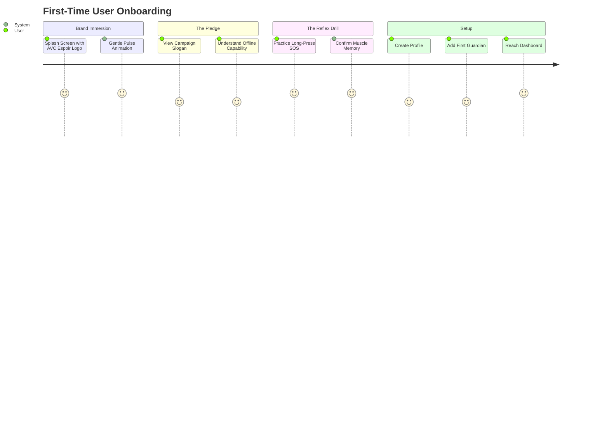
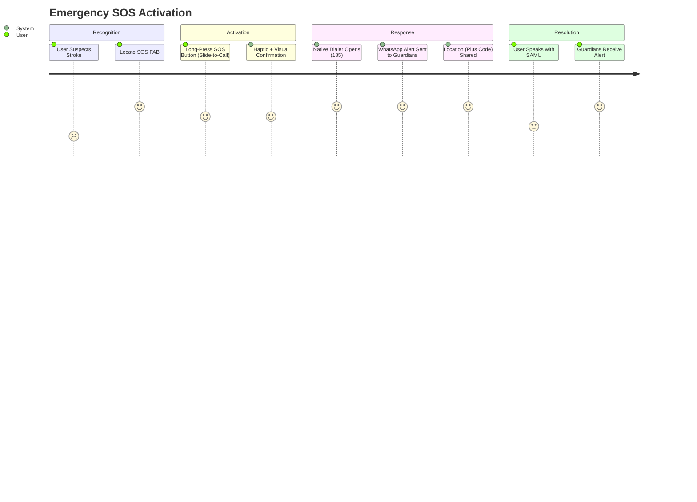
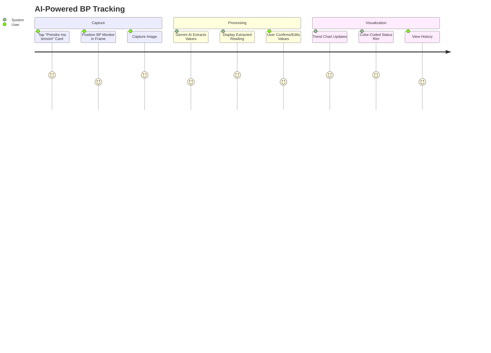
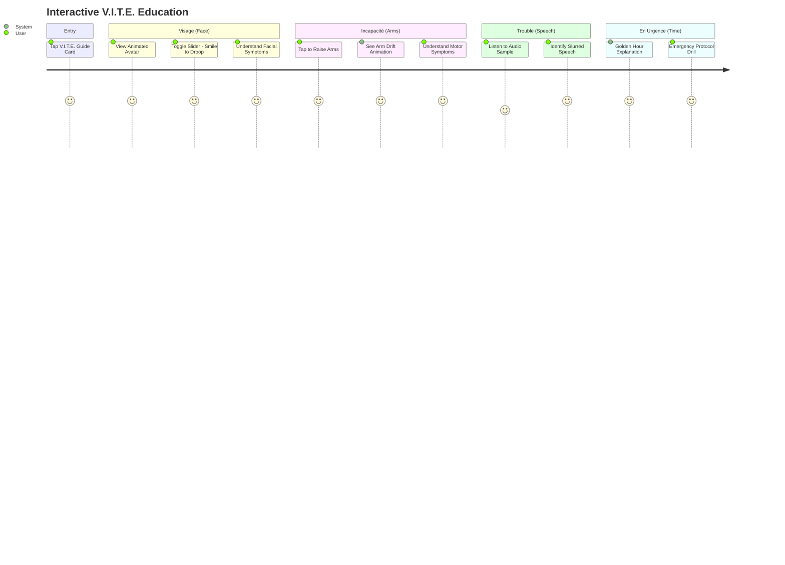

# **1. Product Overview**

* **One-line Summary:** Agir V.I.T.E. is an offline-first mobile application designed to reduce stroke-related morbidity and mortality in Côte d'Ivoire through education, prevention monitoring, and emergency response.

* **Value Proposition:** The application transforms stroke prevention from passive information consumption into an active, intelligent, and empathetic digital health companion. Users gain immediate access to life-saving emergency protocols, real-time blood pressure monitoring with AI-powered OCR, and a comprehensive educational platform—all functioning seamlessly offline in areas with poor connectivity.

* **Business Goals:**
  - Reduce stroke-related deaths by improving emergency response times within the "Golden Hour"
  - Increase public awareness of stroke symptoms (V.I.T.E. protocol) across Côte d'Ivoire
  - Enable hypertensive patients to actively monitor and manage their blood pressure
  - Create a trusted digital health ecosystem leveraging Ivorian communal culture ("Cercles de Vie")
  - Support ONG AVC Espoir's national sensitization campaign

## **1.1 Scope & Boundaries**

| Scope | Description |
| :---- | :---- |
| **In Scope** | • V.I.T.E. Interactive Educational Guide with Rive animations<br>• Emergency SOS Protocol (Native Call to SAMU 185 + WhatsApp Guardian Alerts)<br>• Hybrid AI-OCR Blood Pressure Tracker (Gemini 1.5 Flash + ML Kit fallback)<br>• Offline Vector Mapping for stroke center locations<br>• "Cercles de Vie" Guardian Network System<br>• Audio-Visual "Stories" Feed with offline caching<br>• "Serene Wave" UI Design System (Neomorphism + Glassmorphism)<br>• Firebase backend with offline persistence<br>• French language support |
| **Out of Scope** | • Gamification & MNO rewards integration (Orange/MTN) - Phase 4<br>• Relaxation/Breathing Mode - Phase 4<br>• Background SMS broadcasting for 2G zones - Phase 3<br>• Local language support (Baoulé, Dioula, Bété) - Phase 3<br>• Gemini Nano on-device AI migration - Phase 4<br>• Direct integration with hospital systems<br>• Telemedicine consultations |

## **1.2 Target Audience**

* **Primary Persona: The Hypertensive Ivorian Adult**
  - Age: 35-65 years
  - Location: Urban (Abidjan) and rural Côte d'Ivoire
  - Health Status: Diagnosed or at-risk hypertensive patients
  - Tech Literacy: Variable (from smartphone novices to proficient users)
  - Device: Entry-level to mid-range Android devices (Tecno, Infinix) and iPhones

* **Secondary Persona: The Family Guardian**
  - Role: Family members or close friends designated as emergency contacts
  - Motivation: Desire to protect loved ones at risk of stroke
  - Engagement: Receives emergency alerts and adherence notifications

* **Tertiary Persona: The Caregiver/Healthcare Worker**
  - Role: Nurses, community health workers, medical professionals
  - Use Case: Patient education tool and BP tracking reference

* **User Constraints:**
  - Must work on low-bandwidth mobile networks (2G/No Data)
  - Must function on fragmented device ecosystem (low-end to high-end)
  - Must accommodate users with "white coat syndrome" (health anxiety)
  - Must be accessible to users with limited literacy
  - Must respect cultural sensitivities around health discussions

## **1.3 Expected Outcomes (Success Metrics)**

* **User Outcomes:**
  - Users can identify all 4 V.I.T.E. stroke symptoms in < 60 seconds after onboarding
  - Emergency SOS can be triggered and SAMU contacted in < 10 seconds
  - Users complete BP tracking entry via AI-OCR in < 30 seconds
  - 80% of users successfully add at least one Guardian to their "Cercle de Vie"
  - Users can locate nearest stroke center within 3 taps

* **System Outcomes:**
  - 99.9% offline functionality for core features (V.I.T.E. Guide, Emergency, BP History)
  - < 3 second app cold start on mid-range devices
  - 60fps animation performance on target devices with Impeller engine
  - 95%+ accuracy for AI-OCR blood pressure reading extraction
  - < 500MB app size including offline map data

* **Health Outcomes (Long-term):**
  - Measurable reduction in stroke response time in pilot regions
  - Increased hypertension monitoring adherence rates
  - Improved stroke symptom recognition in target population

---

# **2. User Interfaces (UI/UX)**

*This section defines the interaction layer based on the "Calm Technology" philosophy—creating experiences of "assurance and serenity" rather than alarm.*

## **2.1 Core Interaction Loop**

* **Entry Point:** User opens app → Sees personalized Dashboard with time-aware greeting ("Bonjour, [Name]")

* **Action:** User can:
  1. **Learn:** Access V.I.T.E. Interactive Guide via card tap
  2. **Monitor:** Capture BP reading via camera (AI-OCR)
  3. **Respond:** Trigger emergency SOS via floating action button

* **Feedback:**
  - Haptic feedback patterns: Light tap (success), Double tap (warning), Heavy vibration (emergency)
  - Visual state machines via Rive animations (Idle → Loading → Success/Error)
  - Audio guidance for critical actions (voice actor recordings)

* **Completion:**
  - Educational content: Return to Dashboard or continue to next module
  - BP Tracking: Data saved with trend visualization
  - Emergency: Native dialer opens with SAMU (185), WhatsApp alerts sent to Guardians

## **2.2 Critical User Journeys (Mermaid)**

### Journey 1: First-Time Onboarding



### Journey 2: Emergency Response (Réagir)



### Journey 3: Blood Pressure Tracking (Agir)



### Journey 4: V.I.T.E. Learning (Savoir)



## **2.3 Interface Wireframes (ASCII)**

*Use these layouts as the spatial source of truth.*

### Onboarding Screen 1: Brand Immersion
```
+-------------------------------------------------------+
|                                                       |
|                                                       |
|                    [AVC ESPOIR LOGO]                  |
|                   ~~~Gentle Pulse~~~                  |
|                                                       |
|                                                       |
|                                                       |
|                                                       |
|                                                       |
|                   [ Continuer → ]                     |
+-------------------------------------------------------+
```

### Onboarding Screen 3: The Reflex Drill
```
+-------------------------------------------------------+
|                                                       |
|        "Apprenez le réflexe qui sauve"               |
|                                                       |
|          En cas d'urgence, maintenez                 |
|          le bouton SOS appuyé 2 secondes             |
|                                                       |
|                                                       |
|              +-------------------+                    |
|              |                   |                    |
|              |    [ SOS ]        |   ← Extruded      |
|              |    (Long Press)   |      Button       |
|              +-------------------+                    |
|                                                       |
|                Progress: [====----]                   |
+-------------------------------------------------------+
```

### Dashboard (Home) - Bento Box Layout
```
+-------------------------------------------------------+
| Bonjour, Amadou.                     [🔔] [⚙️]       |
| Votre santé, notre priorité                          |
+-------------------------------------------------------+
|                                                       |
| +---------------------------------------------------+ |
| |                STATUT ACTUEL                      | |
| |                                                   | |
| |        [===== 120/80 mmHg =====]                 | |
| |         ↑ Normal · Dernière mesure: 2h          | |
| |         [Color-Coded Rim - Green/Yellow/Red]    | |
| +---------------------------------------------------+ |
|                                                       |
| +----------------------+  +----------------------+    |
| |  📷 Prendre ma       |  |  ⚠️ Urgence          |    |
| |     tension          |  |     V.I.T.E.         |    |
| |  [Camera/OCR Icon]   |  |  [Warning Triangle]  |    |
| +----------------------+  +----------------------+    |
|                                                       |
| +----------------------+  +----------------------+    |
| |  📖 Guide V.I.T.E.   |  |  📍 Centres AVC     |    |
| |  [Learn the Signs]   |  |  [Find Hospitals]   |    |
| +----------------------+  +----------------------+    |
|                                                       |
| +---------------------------------------------------+ |
| |  🎬 Histoires · Témoignages de survivants         | |
| +---------------------------------------------------+ |
|                                                       |
|                      [ 🆘 ]                           |
|                   Emergency FAB                       |
+-------------------------------------------------------+
| [🏠 Home] [📊 Suivi] [👥 Cercle] [📰 Infos] [👤 Profil] |
+-------------------------------------------------------+
```

### V.I.T.E. Interactive Guide - Visage Screen
```
+-------------------------------------------------------+
| ← Retour           Guide V.I.T.E.              1/4   |
+-------------------------------------------------------+
|                                                       |
|                      [V]                              |
|               VISAGE - Le Visage                      |
|                                                       |
|        +-----------------------------+                |
|        |                             |                |
|        |    [Animated Avatar]        |                |
|        |    😊 ←──────→ 😵            |                |
|        |                             |                |
|        +-----------------------------+                |
|                                                       |
|        [○─────────────────────────○]                  |
|         Normal              Paralysie                 |
|                                                       |
|        "Demandez à la personne de sourire.           |
|         Un côté du visage ne bouge pas?"             |
|                                                       |
|                   [🔊 Écouter]                        |
|                                                       |
|                  [ Suivant → ]                        |
+-------------------------------------------------------+
```

### Emergency SOS Modal (Glassmorphism)
```
+-------------------------------------------------------+
|//////////////////FROSTED GLASS//////////////////////  |
|                                                       |
|        ╔═══════════════════════════════════╗         |
|        ║                                   ║         |
|        ║     🚨 URGENCE DÉCLENCHÉE 🚨     ║         |
|        ║                                   ║         |
|        ║   Appel au SAMU (185) en cours   ║         |
|        ║                                   ║         |
|        ║   📍 Location: 6QJ4+2X Abidjan   ║         |
|        ║                                   ║         |
|        ║   ✓ Alerte WhatsApp envoyée      ║         |
|        ║     → Marie (Épouse)             ║         |
|        ║     → Dr. Koné (Médecin)         ║         |
|        ║                                   ║         |
|        ║        [ Annuler ]               ║         |
|        ╚═══════════════════════════════════╝         |
|//////////////////FROSTED GLASS//////////////////////  |
+-------------------------------------------------------+
```

## **2.4 UI Behaviors & States**

* **Loading:**
  - Use Rive skeleton loaders with "Gentle Pulse" animation
  - Never use full-page spinners; maintain context
  - BP OCR: Show camera viewfinder with scanning animation

* **Empty States:**
  - No BP History: Illustration of BP monitor + "Commencez votre suivi" CTA button
  - No Guardians: Illustration of connected hearts + "Ajoutez votre cercle" CTA
  - No Stories: "Nouveaux contenus bientôt disponibles" with refresh option

* **Errors:**
  - Form errors appear inline below specific fields (red terracotta accent)
  - OCR failure: "Lecture échouée" with manual entry fallback prominently displayed
  - Network errors: Banner notification with offline mode reassurance
  - Never use aggressive red (#FF0000); use Terracotta (#E29578) for urgency

* **Success:**
  - Rive checkmark animation with haptic feedback
  - Toast notifications slide in from bottom (auto-dismiss 3 seconds)
  - BP saved: Trend chart updates with smooth animation

* **Emergency State:**
  - Glassmorphic modal overlays entire screen
  - Heavy haptic vibration pattern
  - All other interactions disabled until resolved or cancelled

---

# **3. Functional Requirements**

*Detailed logic for the "What". Implementation details belong in ARCHI.md.*

## **3.1 Feature: Onboarding Experience ("Hand-Holding" Flow)**

**User Story:**

AS A first-time user
I WANT TO be guided through the app's purpose and emergency protocol
SO THAT I understand how to use it to protect myself and my loved ones

**Acceptance Criteria (Gherkin):**

* [x] **Scenario 1: Brand Immersion Screen**
  * **GIVEN** the user opens the app for the first time
  * **WHEN** the splash screen loads
  * **THEN** the AVC Espoir logo is displayed with a "Gentle Pulse" animation
  * **AND** the user can tap "Continuer" to proceed

* [x] **Scenario 2: Campaign Pledge Screen**
  * **GIVEN** the user is on the pledge screen
  * **WHEN** the screen displays
  * **THEN** the slogan "Contre l'AVC, S'INFORMER, PREVENIR ET AGIR VITE, pour sauver des Vies" is shown
  * **AND** the offline capability is explained

* [x] **Scenario 3: Emergency Reflex Drill**
  * **GIVEN** the user is on the reflex drill screen
  * **WHEN** the user long-presses the SOS button for 2 seconds
  * **THEN** the button shows a progress indicator
  * **AND** upon completion, haptic feedback confirms success
  * **AND** the user is allowed to proceed to profile setup

* [x] **Scenario 4: Skip Drill Failure**
  * **GIVEN** the user is on the reflex drill screen
  * **WHEN** the user tries to skip without completing the drill
  * **THEN** a gentle prompt encourages completing the exercise
  * **AND** the user cannot proceed until the drill is completed at least once

**Business Rules:**

* [x] Rule 1: Onboarding must be completed before accessing the main Dashboard
* [x] Rule 2: The emergency drill is mandatory and cannot be skipped
* [x] Rule 3: Onboarding state is persisted locally; user sees it only once per installation

---

## **3.2 Feature: Interactive V.I.T.E. Guide (Savoir)**

**User Story:**

AS A user concerned about stroke
I WANT TO learn the V.I.T.E. warning signs through interactive exercises
SO THAT I can quickly recognize stroke symptoms in myself or others

**Acceptance Criteria (Gherkin):**

* [x] **Scenario 1: Visage (Face) - Interactive Avatar**
  * **GIVEN** the user is on the "Visage" screen
  * **WHEN** the user moves the interactive slider
  * **THEN** the animated avatar transitions from a normal smile to facial drooping
  * **AND** explanatory text describes what to look for

* [x] **Scenario 2: Incapacité (Arms) - Tap Interaction**
  * **GIVEN** the user is on the "Incapacité" screen
  * **WHEN** the user taps to raise the avatar's arms
  * **THEN** one arm visibly drifts downward in the animation
  * **AND** explanatory text describes arm weakness symptoms

* [x] **Scenario 3: Trouble (Speech) - Audio Sample**
  * **GIVEN** the user is on the "Trouble" screen
  * **WHEN** the user taps the audio button
  * **THEN** a sample of slurred vs. normal speech plays
  * **AND** the user can replay the sample

* [x] **Scenario 4: En Urgence (Time) - Golden Hour**
  * **GIVEN** the user is on the "En Urgence" screen
  * **WHEN** the content displays
  * **THEN** the importance of the "Golden Hour" is explained
  * **AND** a direct link to trigger SOS is provided

* [x] **Scenario 5: Offline Functionality**
  * **GIVEN** the device has no network connectivity
  * **WHEN** the user accesses the V.I.T.E. Guide
  * **THEN** all animations, text, and audio play without errors
  * **AND** no loading indicators or error states appear

**Business Rules:**

* [x] Rule 1: All V.I.T.E. content (animations, text, audio) must be bundled with the app for offline access
* [x] Rule 2: Each V.I.T.E. section uses Rive State Machines for animations, not code-driven animations
* [x] Rule 3: Progress through V.I.T.E. modules is tracked but not required for app access

---

## **3.3 Feature: Emergency Response Engine (Réagir)**

**User Story:**

AS A user or bystander witnessing stroke symptoms
I WANT TO trigger an emergency response with minimal friction
SO THAT medical help and personal guardians are alerted immediately

**Acceptance Criteria (Gherkin):**

* [x] **Scenario 1: SOS Activation via Long Press**
  * **GIVEN** the user is on any screen with the SOS FAB visible
  * **WHEN** the user long-presses the SOS button for 2 seconds (Slide-to-Call)
  * **THEN** a visual progress indicator shows activation progress
  * **AND** haptic feedback (heavy vibration) confirms activation
  * **AND** the emergency protocol initiates

* [x] **Scenario 2: Immediate SAMU Call**
  * **GIVEN** the SOS has been activated
  * **WHEN** the emergency protocol starts
  * **THEN** the native phone dialer opens with SAMU number (185) pre-filled
  * **AND** this occurs regardless of data connectivity

* [x] **Scenario 3: WhatsApp Guardian Alert**
  * **GIVEN** the SOS has been activated
  * **AND** the user has configured Guardians in their "Cercle de Vie"
  * **WHEN** the emergency protocol starts
  * **THEN** a pre-composed WhatsApp message is prepared for each Guardian
  * **AND** the message includes: timestamp, alert type, and Plus Code location
  * **AND** the WhatsApp app opens for the user to send

* [x] **Scenario 4: Location Capture**
  * **GIVEN** the SOS has been activated
  * **WHEN** the location is captured
  * **THEN** GPS coordinates are obtained using geolocator
  * **AND** coordinates are converted to Plus Code format (e.g., "6QJ4+2X Abidjan")
  * **AND** the Plus Code is included in all alert messages

* [x] **Scenario 5: Accidental Trigger Prevention**
  * **GIVEN** the user taps the SOS button briefly (< 2 seconds)
  * **WHEN** the press is released
  * **THEN** the emergency protocol does NOT initiate
  * **AND** the progress indicator resets

* [x] **Scenario 6: Emergency Cancellation**
  * **GIVEN** the emergency modal is displayed
  * **WHEN** the user taps "Annuler" within 5 seconds
  * **THEN** the SAMU call is NOT initiated (if not already connected)
  * **AND** a confirmation message appears
  * **AND** the modal closes

**Business Rules:**

* [x] Rule 1: SAMU call (185) uses native dialer and must work without internet connectivity
* [x] Rule 2: WhatsApp alerts are the primary channel for Guardian notifications in V1
* [x] Rule 3: Long-press duration of 2 seconds prevents accidental triggers
* [x] Rule 4: Plus Codes are used for location sharing to ensure offline-friendly addressing
* [x] Rule 5: Full background SMS broadcasting is scheduled for Phase 3 (2G fallback)

---

## **3.4 Feature: Intelligent Hypertension Tracker (Agir)**

**User Story:**

AS A hypertensive patient
I WANT TO easily log my blood pressure readings using my phone's camera
SO THAT I can monitor my health trends without manual data entry

**Acceptance Criteria (Gherkin):**

* [x] **Scenario 1: AI-OCR Capture (Online - Gemini)**
  * **GIVEN** the device has internet connectivity
  * **AND** the user taps "Prendre ma tension"
  * **WHEN** the user captures an image of their BP monitor display
  * **THEN** the image is sent to Gemini 1.5 Flash API
  * **AND** the systolic and diastolic values are extracted
  * **AND** the extracted values are displayed for user confirmation

* [x] **Scenario 2: ML Kit Fallback (Offline)**
  * **GIVEN** the device has NO internet connectivity
  * **AND** the user taps "Prendre ma tension"
  * **WHEN** the user captures an image of their BP monitor display
  * **THEN** the local ML Kit OCR processes the image
  * **AND** the extracted values are displayed in "Review Mode" for verification
  * **AND** a note indicates offline processing was used

* [x] **Scenario 3: Manual Entry Fallback**
  * **GIVEN** the OCR fails to extract valid readings
  * **WHEN** the error state is displayed
  * **THEN** a manual entry form appears
  * **AND** the user can input systolic, diastolic, and pulse values
  * **AND** the entry is saved with manual flag

* [x] **Scenario 4: Data Visualization**
  * **GIVEN** the user has multiple BP readings saved
  * **WHEN** the user views the "Suivi" (Tracking) screen
  * **THEN** an animated line chart (fl_chart) displays the trend
  * **AND** data points are color-coded (Green: Normal, Yellow: Elevated, Red: High)
  * **AND** the user can filter by time range (Week, Month, All)

* [x] **Scenario 5: Status Card Update**
  * **GIVEN** a new BP reading has been saved
  * **WHEN** the user returns to the Dashboard
  * **THEN** the "Statut Actuel" card displays the latest reading
  * **AND** the rim color reflects the reading's status category

**Business Rules:**

* [x] Rule 1: Gemini 1.5 Flash is the primary OCR engine; ML Kit is the offline fallback
* [x] Rule 2: All BP data is stored locally with Firestore sync when online
* [x] Rule 3: BP status categories follow WHO guidelines:
  - Normal: < 120/80 mmHg
  - Elevated: 120-129/< 80 mmHg
  - High (Stage 1): 130-139/80-89 mmHg
  - High (Stage 2): ≥ 140/≥ 90 mmHg
* [x] Rule 4: A minimum of 2 readings is required to display trend charts

---

## **3.5 Feature: "Cercles de Vie" (Social Health Guardians)**

**User Story:**

AS A user with health concerns
I WANT TO designate trusted family members or friends as my "Guardians"
SO THAT they are automatically alerted in emergencies or if my health adherence drops

**Acceptance Criteria (Gherkin):**

* [x] **Scenario 1: Add Guardian**
  * **GIVEN** the user is on the "Cercle de Vie" screen
  * **WHEN** the user taps "Ajouter un Gardien"
  * **THEN** a form appears for Guardian name and WhatsApp number
  * **AND** upon save, the Guardian appears in the list

* [x] **Scenario 2: Guardian Notification on SOS**
  * **GIVEN** the user has at least one Guardian configured
  * **WHEN** an SOS is triggered
  * **THEN** each Guardian receives a WhatsApp alert with location

* [x] **Scenario 3: Adherence Alerts (Future Phase)**
  * **GIVEN** the user has not logged BP for 7 consecutive days
  * **WHEN** the adherence threshold is breached
  * **THEN** Guardians receive a gentle reminder notification
  * **AND** the user is prompted to log their BP

* [x] **Scenario 4: Remove Guardian**
  * **GIVEN** the user has existing Guardians
  * **WHEN** the user swipes to delete or taps remove on a Guardian
  * **THEN** a confirmation dialog appears
  * **AND** upon confirmation, the Guardian is removed from the list

**Business Rules:**

* [x] Rule 1: Maximum of 5 Guardians per user
* [x] Rule 2: Guardian phone numbers must be valid WhatsApp numbers
* [x] Rule 3: Users must have at least one Guardian to enable SOS Guardian alerts
* [x] Rule 4: Adherence monitoring alerts are a Phase 2+ feature

---

## **3.6 Feature: Audio-Visual Stories Feed**

**User Story:**

AS A user seeking information about stroke
I WANT TO watch short, engaging video stories from doctors and survivors
SO THAT I can learn in an accessible, emotionally resonant format

**Acceptance Criteria (Gherkin):**

* [x] **Scenario 1: Stories Feed Display**
  * **GIVEN** the user navigates to the Stories section
  * **WHEN** the feed loads
  * **THEN** a TikTok-style vertical video feed is displayed
  * **AND** each story shows thumbnail, title, and duration

* [x] **Scenario 2: Video Playback**
  * **GIVEN** the user taps on a story
  * **WHEN** the video player opens
  * **THEN** the video plays in full-screen vertical format
  * **AND** the user can pause, seek, and adjust volume

* [x] **Scenario 3: Offline Caching**
  * **GIVEN** the device has downloaded stories
  * **WHEN** the device goes offline
  * **THEN** cached stories are available for playback
  * **AND** unavailable stories show a disabled state with download option

* [x] **Scenario 4: Content Categories**
  * **GIVEN** the stories feed is displayed
  * **WHEN** the user views category filters
  * **THEN** categories include: "Médecins", "Survivants", "Prévention", "Témoignages"

**Business Rules:**

* [x] Rule 1: Stories are cached locally for offline playback
* [x] Rule 2: Stories are managed via Firebase/CMS by ONG AVC Espoir team
* [x] Rule 3: Video format: Vertical (9:16), max 3 minutes, compressed for mobile

---

## **3.7 Feature: Offline Stroke Center Mapping**

**User Story:**

AS A user during a stroke emergency
I WANT TO quickly find the nearest hospital with a CT Scanner
SO THAT I can direct emergency responders to the appropriate facility

**Acceptance Criteria (Gherkin):**

* [x] **Scenario 1: Map Display**
  * **GIVEN** the user taps "Centres AVC"
  * **WHEN** the map screen loads
  * **THEN** a vector map of Côte d'Ivoire is displayed
  * **AND** stroke centers are marked with pins
  * **AND** the map works completely offline

* [x] **Scenario 2: Center Details**
  * **GIVEN** the user taps a stroke center pin
  * **WHEN** the info panel opens
  * **THEN** the center name, address, and CT Scanner availability are shown
  * **AND** a "Directions" button is available

* [x] **Scenario 3: User Location**
  * **GIVEN** location permissions are granted
  * **WHEN** the map is displayed
  * **THEN** the user's current location is shown
  * **AND** nearest centers are highlighted

**Business Rules:**

* [x] Rule 1: Map data uses flutter_map + vector_map_tiles for offline capability
* [x] Rule 2: Stroke center data is bundled with the app and updated via app releases
* [x] Rule 3: Centers with CT Scanners are prioritized in results

---

# **4. Non-Functional Requirements**

## **4.1 Performance**

| Requirement | Target |
| :---- | :---- |
| App cold start time | < 3 seconds on mid-range devices |
| Animation frame rate | 60fps with Impeller engine |
| AI-OCR response time | < 5 seconds (Gemini), < 2 seconds (ML Kit) |
| Offline data sync | < 30 seconds when connectivity restored |
| App size | < 500MB including offline maps |

## **4.2 Reliability**

| Requirement | Target |
| :---- | :---- |
| Offline functionality | 99.9% for core features |
| Firebase uptime | 99.9% |
| Emergency protocol success | 100% (native call always available) |
| Data persistence | Zero data loss with local + cloud backup |

## **4.3 Security & Privacy**

| Requirement | Implementation |
| :---- | :---- |
| Authentication | Firebase Auth (Anonymous + Phone) |
| Data encryption | At-rest and in-transit encryption |
| Health data handling | GDPR/local compliance for health data |
| Guardian consent | Explicit opt-in for Guardian features |

## **4.4 Accessibility**

| Requirement | Implementation |
| :---- | :---- |
| Touch targets | Minimum 60x60 logical pixels for emergency actions |
| Dynamic Type | Support for iOS/Android large text settings |
| High Contrast Mode | Toggle available in settings |
| Voice guidance | Audio for critical actions and V.I.T.E. content |
| Haptic feedback | Distinct patterns for success, warning, emergency |

---

# **5. Design System: "Serene Wave"**

## **5.1 Color Palette**

| Role | Color | Hex | Usage |
| :---- | :---- | :---- | :---- |
| Primary | Deep Teal | #006D77 | Headers, primary buttons, brand |
| Secondary | Soft Sage | #83C5BE | Accents, secondary elements |
| Background | Warm Sand | #EDF6F9 | Card backgrounds, surfaces |
| Action/Emergency | Terracotta | #E29578 | Urgent actions (replaces red) |
| Dark Mode Base | Deep Charcoal | #121212 | Dark mode background |
| Text Primary | Dark Gray | #1D1D1D | Body text |
| Text Secondary | Medium Gray | #6B6B6B | Captions, hints |
| Success | Forest Green | #2D6A4F | Positive states |
| Warning | Amber | #F9A825 | Warning states |

## **5.2 Typography**

- **Headings:** [Google Font - e.g., Outfit, Inter] - Bold weight
- **Body:** [Google Font - e.g., Inter, Roboto] - Regular weight
- **Captions:** Same family - Light weight
- **Emergency Text:** Bold, larger size, high contrast

## **5.3 Component Styles**

- **Neomorphism:** Soft lights/shadows for tactile button appearance
- **Glassmorphism:** Frosted glass effect for modals and overlays
- **Cards:** Rounded corners (16px), subtle shadows, warm sand background
- **Buttons:** Rounded (8px), adequate padding, clear hover/pressed states

---

# **6. Technical Architecture Summary**

*Full details in ARCHI.md*

| Component | Technology | Justification |
| :---- | :---- | :---- |
| Framework | Flutter + Impeller | Cross-platform, 60fps rendering |
| Backend | Firebase (Firestore, Auth, Functions) | Offline sync, scalable |
| Local Database | Hive or Isar | Fast NoSQL for offline caching |
| Mapping | flutter_map + vector_map_tiles | Offline vector maps |
| Animations | Rive (State Machines) | Interactive, designer-controlled |
| Charts | fl_chart | Animated health data visualization |
| AI-OCR | Gemini 1.5 Flash + ML Kit | Superior accuracy + offline fallback |
| State Management | Riverpod | Compile-time safety, testable |
| Emergency | geolocator, url_launcher | Location + Native Call/WhatsApp |

---

# **7. Implementation Roadmap**

## **Phase 1: Core Foundation (Months 1-3) - MVP**

- [ ] Flutter project setup with Clean Architecture, Riverpod, Impeller
- [ ] Firebase Authentication (Anonymous + Phone)
- [ ] Onboarding Flow 2.0 (Brand Immersion + Reflex Drill)
- [ ] Interactive V.I.T.E. Guide with Rive State Machines
- [ ] Emergency Protocol: Native Call (185) + WhatsApp Guardians
- [ ] Basic Dashboard with "Serene Wave" design

**Goal:** Functional app that educates users and saves lives immediately.

## **Phase 2: Intelligence & Data (Months 3-5)**

- [ ] Hybrid AI-OCR Tracker (Gemini 1.5 Flash + ML Kit)
- [ ] Data Visualization with fl_chart
- [ ] Offline Mapping with vector tiles
- [ ] Audio-Visual Stories Feed with caching
- [ ] "Cercles de Vie" Guardian management

**Goal:** Daily utility tool for hypertensive patients.

## **Phase 3: Resilience & Hardening (Months 5-7)**

- [ ] Background SMS Integration for 2G zones
- [ ] Local Languages Audio (Baoulé, Dioula, Bété)
- [ ] Field Testing in rural zones (Korhogo)
- [ ] Performance optimization for low-end devices

**Goal:** Reach the most vulnerable populations.

## **Phase 4: Future Evolution (Year 1+)**

- [ ] Gamification with Orange/MTN API integration
- [ ] Relaxation Mode (breathing exercises)
- [ ] Gemini Nano Migration for on-device AI
- [ ] Expanded health monitoring features

---

# **8. Open Questions**

* [ ] What is the exact list of stroke centers with CT Scanners to be included in the offline map?
* [ ] What analytics/telemetry should be implemented to measure app effectiveness?
* [ ] What is the approval process for content in the Stories feed?
* [ ] Are there specific regulatory requirements for health apps in Côte d'Ivoire?
* [ ] What is the plan for Guardian consent and privacy notifications?
* [ ] Should there be a web dashboard for ONG AVC Espoir to monitor adoption metrics?

---

# **9. Appendix**

## **A. V.I.T.E. Acronym Reference**

| Letter | French | English | Symptom |
| :---- | :---- | :---- | :---- |
| V | Visage | Face | Facial drooping |
| I | Incapacité | Inability | Arm weakness |
| T | Trouble | Trouble | Speech difficulty |
| E | En Urgence | Emergency | Time to call SAMU |

## **B. Emergency Numbers**

| Service | Number |
| :---- | :---- |
| SAMU (Emergency Medical) | 185 |
| Police | 110 |
| Fire | 180 |

## **C. Device Target Matrix**

| Category | Examples | Priority |
| :---- | :---- | :---- |
| Entry-Level Android | Tecno Spark, Infinix Hot | High |
| Mid-Range Android | Samsung A-series, Xiaomi Redmi | High |
| High-End Android | Samsung S-series, Pixel | Medium |
| iPhone | iPhone 8 and newer | Medium |

---

*Document Version: 2.0.0 | Last Updated: December 2025 | Status: Draft*
